## SAE Reseau
-------------
### Contents
------
1. [Warm-up](#warm_up)
------
Before to start the project, launch the virtual machine with the command : “$ ~/iut-vms/vnet/nemu-vnet netdns”

Save with the command: “$ ~/iut-vms/vnet/nemu-restore ~/vnet/netdns.tgz”

# 1) warm-up <a name="Warm_up"></a>

### 1.1) Configuration IP of the machine: 

1) In the folder /etc/network/interfaces of each  machine, add the line : iface eth0 inet DHCP
(this command is enough because the DHCP serveur give the address himself automatically) 


2) The client machine (client1 and client2) have the IP 192.168.0.10 and 0.20 while DNS1 and DNS2 have the IP 192.168.0.1 at 0.2


3) The command “ping \<IP>” allows to check the connection between the machines. In this case, the 4 machines of this network, LAN USER communicate with success between her.


4) The command “route” allows to display the table of routing of the machine. In this case, the table of routing contains the information of the footbridge.

### 1.2) Configuration of local naming  : 


5) Attribute on the folder etc/hosts of the machine, the name of the machine with their address in this form : “<IP> <nom>”. This will allow the communication with the other machine with their name and not their IP.


6) In this case we do the manipulation in the DNS1 to be able to communicate with the 3 other machines


7) We can see with the command “ping” follow with the new name give work in the 3 machines

### 1.3) Config des clients DNS  : 


8) The address contained in the file /etc/resolv.conf isn’t one of the addresses of our network. In this case the address is 172.16.0.3


9) For DNS1 and DNS2 we now put the line : 
- “supersede domain-name-servers 127.0.0.1”;

	For client1 and client2 we put : 
	- “supersede domain-name-servers 192.168.0.1” (client1) 
	- “supersede domain-name-servers 192.168.0.2” (client2) 
The IP address used in the line for client1 is the address of DNS1 while the one used in client2 is the DNS2 IP address. 


10) After doing the followings commands : ifdown eth0 and ifup eth0 on dns1, the IP address contained in the file /etc/resolv.conf go from 172.16.0.3 to the one that we put in the file /etc/dhcp/dhclient.conf


11) In the file /etc/bind/named.conf.options for dns1 and 2, we put the following command : 
- forwarders {172.16.0.3;};
- allow-query {any;};

### 1.4) Config des clients DNS  : 


12) In the file /etc/bind/named.conf.local, we put the following command ; 
- zone "netas" {type master;file "/etc/bind/db.netas";}


13) Then,  we put the following command in the cmd : 
- “# cp /etc/bind/db.empty /etc/bind/db.netas”


14) In the file /etc/bind/db.netas, we put the following lines :  
@ IN SOA dns1.netas. contact.netas. (
1 ; (we don’t forget to increment so the client will download the new serv each time)
604800
86400
2419200
86400 )


15) We go in the file /etc/bind/db.netas and we write this line : “@ IN NS dns1”. It will be used to specify the name of the dns server. 


16) Then, in the same file we’ll also put the following line : “dns1 IN A <IP du serveur dns1>” which will be useful to specify the the IP address of the server.

 

17/18/19) After this the dns server need to be restart, we’ll enter the following commands : 
```
    - systemctl restart named
    - systemctl reload named
    - systemctl status named
 ``` 
The first one will be used to restart the system, the second one to reload the configuration files without having to restart the whole service. And finally the last one is useful to check the status of the server (is he online, …).


20) The communication between the dns server and client is now working (we can test it with the command “ping dns1.netas”, dns1.netas being the name of the server).


21) We add another command but this time for dns2 : “dns2 IN A <IP du serveur dns1>” (we are still in the dns1 file) 


22)  then we add the two following lines in the same file : “dns-primaire IN CNAME dns1” and “dns-secondaire IN CNAME dns2”.


23)  Now, we can try to ping dn1.netas, dns2.netas, dns-primaire.netas and dns-secondaire.netas from client1 with the command “ping <name or IP>


24) We add the following line “IN NS dns2” 


25) After this we will declare the netas zone in dns2 with the following commands 

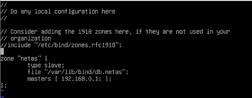

this one is declare as a “slave” and dns was the master. It’s because it’s a secondary server. 


26) We can now test the connection between client1 and 2 and dns1 and dns2 with the common “ping” followed by the name of the server we want to try. 
For example : ping dns2.netas or ping dns-primaire.netas.


27) We can also test the connection with the command “host” like host dns-primaire.netas 192.168.0.1 for example. It’s useful to ensure the fact that both dns1 and dns2 belong to the “netas” zone. 


28) The 2 files are very different but they still are about the same topic. Indeed we can see that both of these files contain the word “netas” in a huge quantity. 
/etc/bind/named.conf.local : 

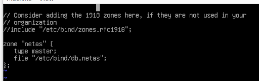

/var/lib/bind/db.netas : 

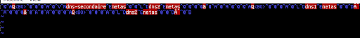


29) The mask /22 means 255.255.252.0 and is used for the IP from 192.168.0.0 to 192.168.3.255


30) Now, we will make a scan of the whole network : LAN SERVER to see all the IPs that are in the network. 

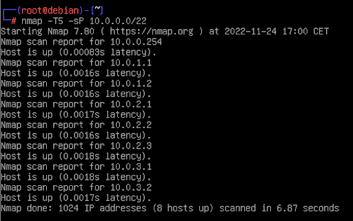


31) We’ll now connect to all the IPs we find during the scan and take the name of each one of them with the command “hostname”
    ```10.0.0.254 : root
    10.0.1.1 : a1
    10.0.1.2 : a2
    10.0.2.1 : s1
    10.0.2.2 : s2
    10.0.2.3 : s3
    10.0.3.1 : p1
    10.0.3.2 : p2
    ```


32)  we put the following line : “s1 IN A 10.0.2.1” for each of the three new server : s1, s2 and s3


33) Then we add 3 new CNAME entry in the document : “creative IN CNAME s1”,
“grayscale IN CNAME s2” and “wonder IN CNAME s3”.


34) We quickly test if the communication between client1 and 2 and the new server s1, s2 and s3 is working well 


35) We can now use the command “startx” to go in graphic mode. It will be useful to try to connect to the website. 


36) By typing the name of the server in an internet browser we can see the website. For example the http://creative.netas :


37) We do the same thing in dns2


38) We will now declare a new zone with the following lines : 

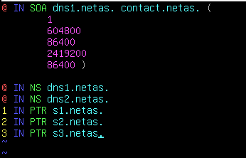


39) The command “host 10.0.2.1” for example gives us the name linked to the machine. (In this case s1) 


40)We now need to add the “slave” server in dns2 in the file named.conf.local :

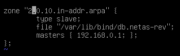


41) We can test if the previous modification also work on client with the same command that in question 39 (“host 10.0.2.1”) 


42) Then we can add the command : “perf IN NS dns1”. It will be used to create a new zone called perf. 


43) Now we defined the new zone in the file named.conf.local (in dns1) with the following lines : 

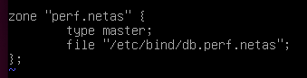


44) After we defined the new zone in the previous file. We create the file 


45) db.perf.netas and put the following lines :

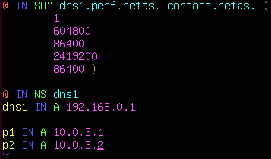


46) The new configuration is working well. As always, the configuration can be tested with the command ping and host. In this case the command “host p1.perf.netas” 


47) The we add one new entry with two IPs : 

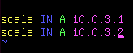


48) When we’re testing the new address we just add (scale.perf.netas) with the command ping we can see that the IP address is changing between 10.0.3.1 and 10.0.3.2. This is thanks to the entry we just put in the db.perf.netas


49) Now, we’re going to install the programs iperf with the command “apt install iperf” 


50) We now put the following lines in the file named.conf.local (in dns2) to initialize it :

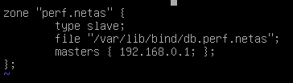


51) We can test again the configuration with the command ping, It’s still working


52) The two servers are indeed used in parallel, we can see it by using the command “iperf -t 5 -c scale.perf.netas”. We can see it because the two test are working with the two different IPs we put earlier 


53) We will now add the reverse zone of perf.netas. To do this we will add the following line in named.conf.local in dns1 :

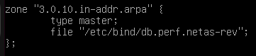

Then we will put this in dns2 (in the same file) : 


And finally in the file db.parf.netas-rev, we’re gonna put the following lines :

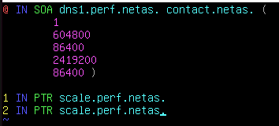


54)  Now we will use all the things we learn during this TP to declare a new “zone” called admin. First we need to declare it in the named.conf.local file of dns1 :

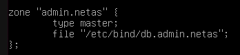

We will do the same in named.conf.local file of dns2 but this time it will be declared as a “slave” :

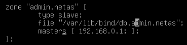

After this we need to declare what’s will be inside of this zone so in the file db.admin.netas we put : 

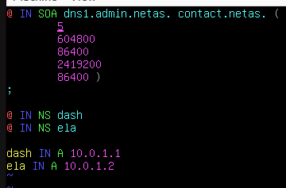

And we're doing all of this again for the reverse zone :

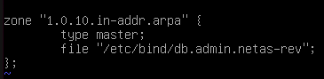

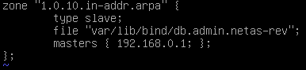

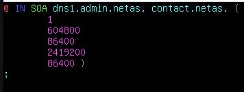

